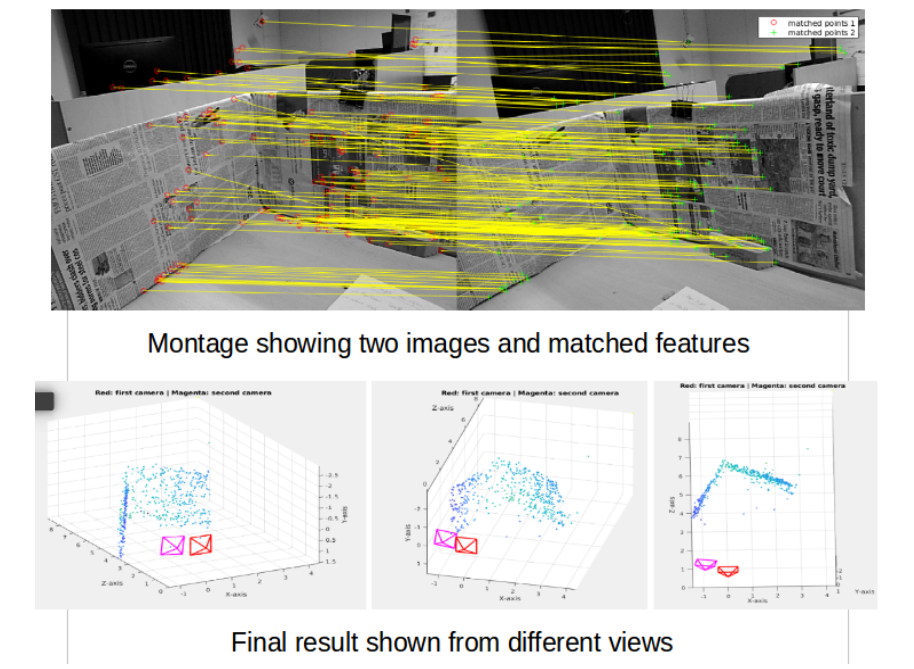
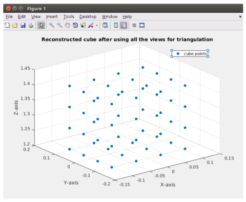

# Robotics and Computer Vision Projects
These are a few of the codes for the projects that I did as part of the Mobile Robotics Course. 

All the codes are documented and there is a report which provides certain details of the implementation and results

## Monocular Camera Calibration
I wrote a code to perform monocular camera calibration using the [Zhang's](https://www.microsoft.com/en-us/research/wp-content/uploads/2016/02/tr98-71.pdf) method in order to find the `K` matrix. 

The accuracy of the intrinsics was evaluated using reprojection error computation.

## Two View Sparse Reconstruction
I wrote a code to perform two view sparse reconstruction of an image captured by a calibrated monocular camera. 

Numerical stability issues in SVD were solved by normalizing the points. The sample output is given below.

## Multi-view triangulation and Non-linear optimizatiion
This code is used to reconstruct a 3D cube using multi-view triangulation. For this, projection matrices of all 8 views were used to set up a least square system which was solved using SVD. The results for the same (reconstruction) are shown below:

  

I also implemented the trust-region strategy of LM algorithm for non-linear least square problems. 